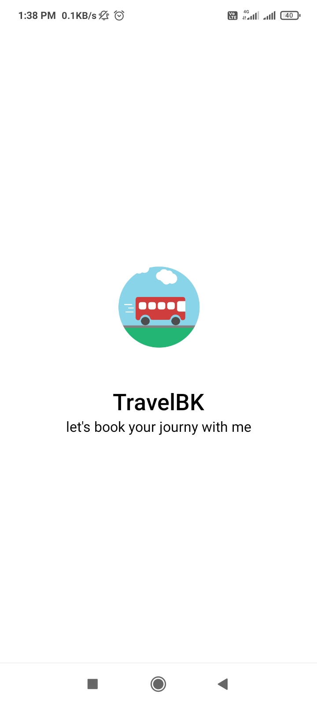
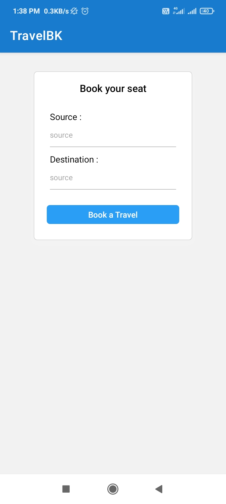
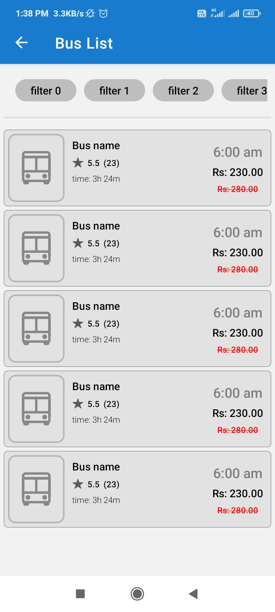
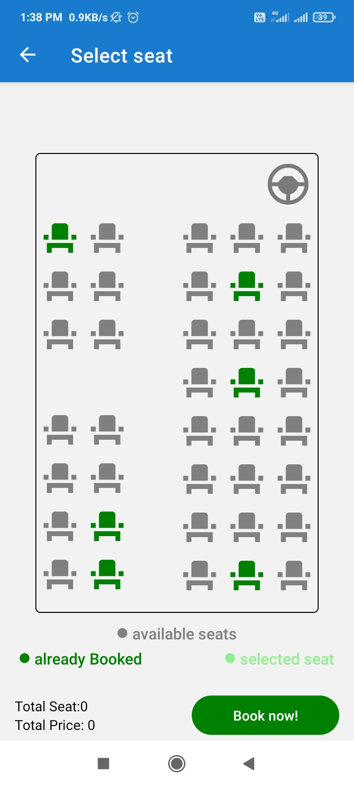
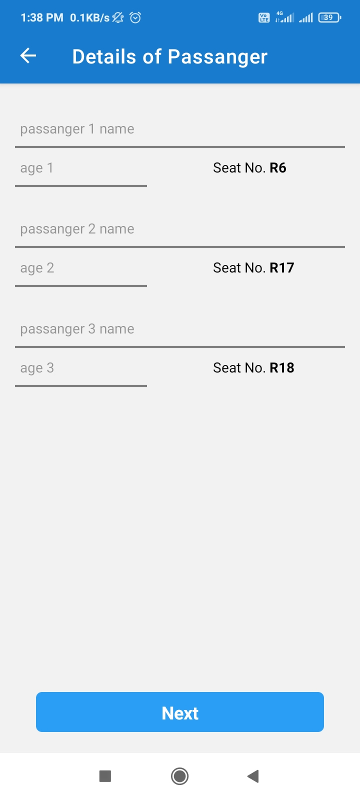
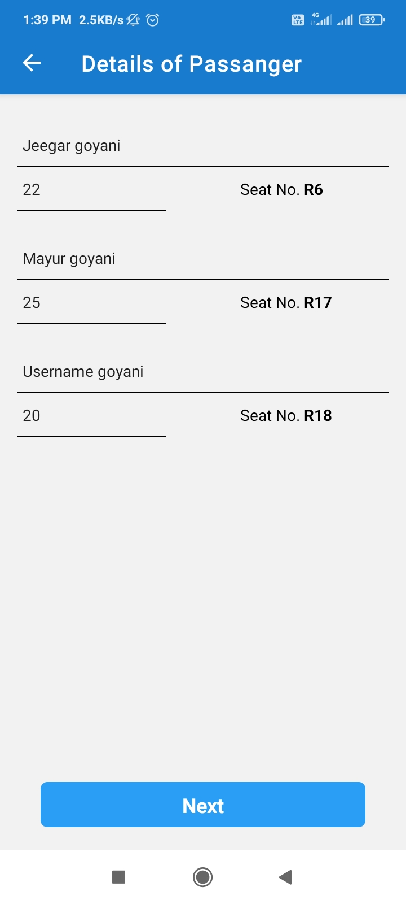
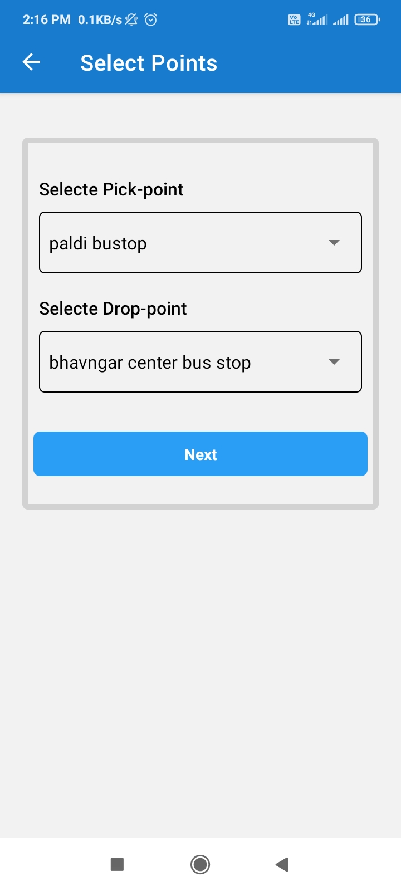
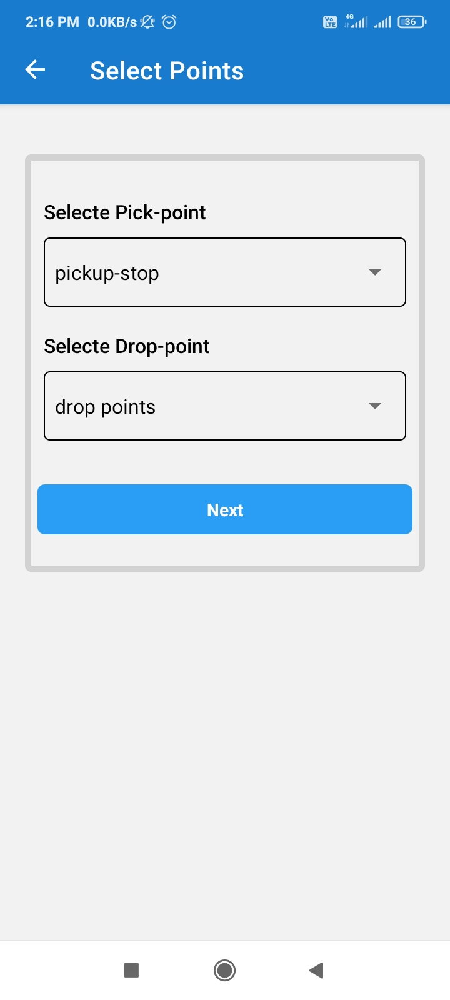
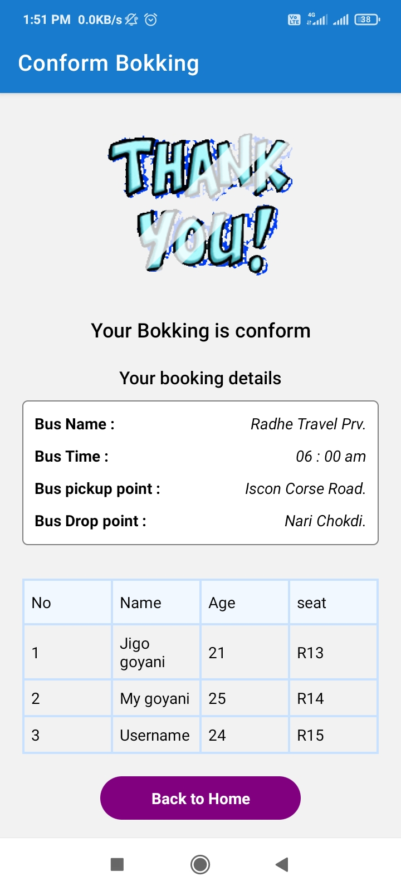

# Sample TravelBK app

## This project is also available in exop snack so it's easy to view.

the demo link will be [TravelBK](https://snack.expo.dev/@jigogoyani/travelbk)

<table>
  <tr>
    <td>Splash screen</td>
    <td>Home Screen</td>
    <td>Bus List screen</td>
    <td>Bus Layout screen 1</td>
  </tr>
  <tr>
    <td></td>
    <td></td>
    <td></td>
    <td></td>
  </tr>
   <tr>
    <td>Bus Layout screen 2</td>
    <td>Passenager Details Screen 1</td>
    <td>Passenager Details screen 2</td>
    <td>Pickup Drop screen 1</td>
  </tr>
  <tr>
    <td></td>
    <td></td>
    <td></td>
    <td></td>
  </tr>
  <tr>
    <td>Bus Layout screen 2</td>
    <td>Conform Booking Screen</td>
  </tr>
  <tr>
    <td></td>
    <td></td>
  </tr>
</table>

## For try on android/ios please follow below step

Open the `App.js` file to start writing some code. You can preview the changes directly on your phone or tablet by scanning the **QR code** or use the iOS or Android emulators. When you're done, click **Save** and share the link!

All projects created in Snack are publicly available, so you can easily share the link to this project via link, or embed it on a web page with the `<>` button.

**if you have any prolems or do contact with me** :- [Jeeegar Goyani - linkedIn](https://in.linkedin.com/in/jeegar-goyani-b05965179).

Also, you can tweet to us [@expo](https://twitter.com/expo) or ask in our [forums](https://forums.expo.io/c/snack).
